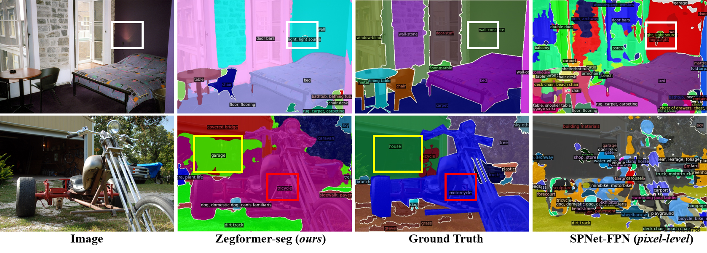

# Decoupling Zero-Shot Semantic Segmentation
This is the official code for the ZegFormer.

ZegFormer is the first framework that decouple the zero-shot semantic segmentation into: 1) class-agnostic segmentation and 2) segment-level zero-shot classification

[comment]: <> (![fig1]&#40;figures/fig1.png&#41;)
## Visualization of semantic segmentation with open vocabularies
ZegFormer is able to segment stuff and things with open vocabularies.
The unannotated vocabularies in COCO-Stuff can also be segmented by ZegFormer.

## Implementation
Coming soon!